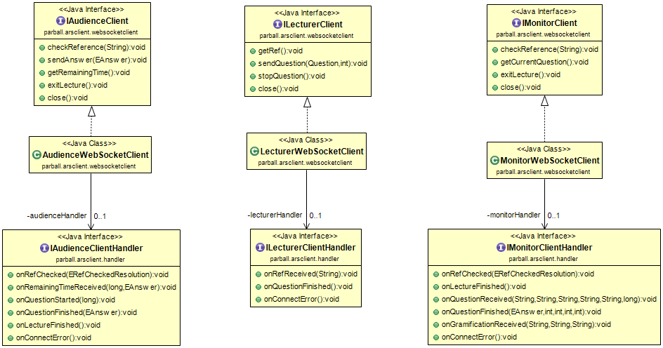

# ars-api-java #

## Description
A Java7+ API for intearct with the [ARS server](https://github.com/adriBall/ars-server). It is aimed to be used in an Android App as lecturer or audience client.

  

There are tests and stubs for simulating the server connection in the `src/pruebas` directory (test names and comments are in spanish).
